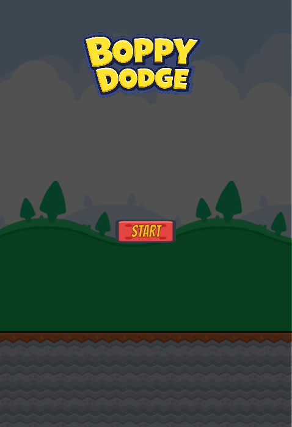
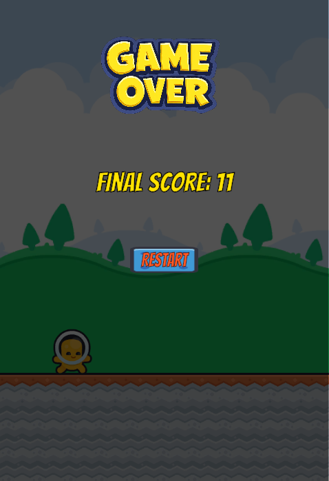

# DodgeCube

A 2D Unity dodge-game built with Unity 6000.3.18f1. Control a cube and dodge falling obstacles for as long as you can.

## Screenshots

| Start Screen | Gameplay | Game Over |
|---|---|---|
|  |  |  |

## How to Play

- Press **A** to move left
- Press **D** to move right
- Dodge the falling cubes! Each obstacle that hits the ground increments your score.
- If an obstacle hits you, the game ends — your final score is displayed with an option to restart.

## Project Structure

| File | Purpose |
|---|---|
| `Assets/Scripts/PlayerController.cs` | Player movement (A/D input, horizontal translation clamped to camera viewport bounds, only when game is active) |
| `Assets/Scripts/GameManager.cs` | Manages game state (active/inactive), spawns player and obstacles at random X within camera bounds, tracks score, handles game-over panel with final score and restart |
| `Assets/Scripts/Obstacle.cs` | Falling obstacle — falls downward at constant speed, increments score on ground collision, triggers game over on player collision |
| `Assets/Prefab/Droppy.prefab` | The falling obstacle prefab |
| `Assets/Prefab/Boppy.prefab` | The player cube prefab |
| `Assets/Scenes/GamePlayScene.unity` | The main game scene |
| `ProjectSettings/` | Unity project configuration (URP, physics, quality, etc.) |

## Built With

- **Unity** 6000.3.18f1
- **Universal Render Pipeline** (2D URP)
- **TextMesh Pro** (score UI)
- **Unity Input System**
